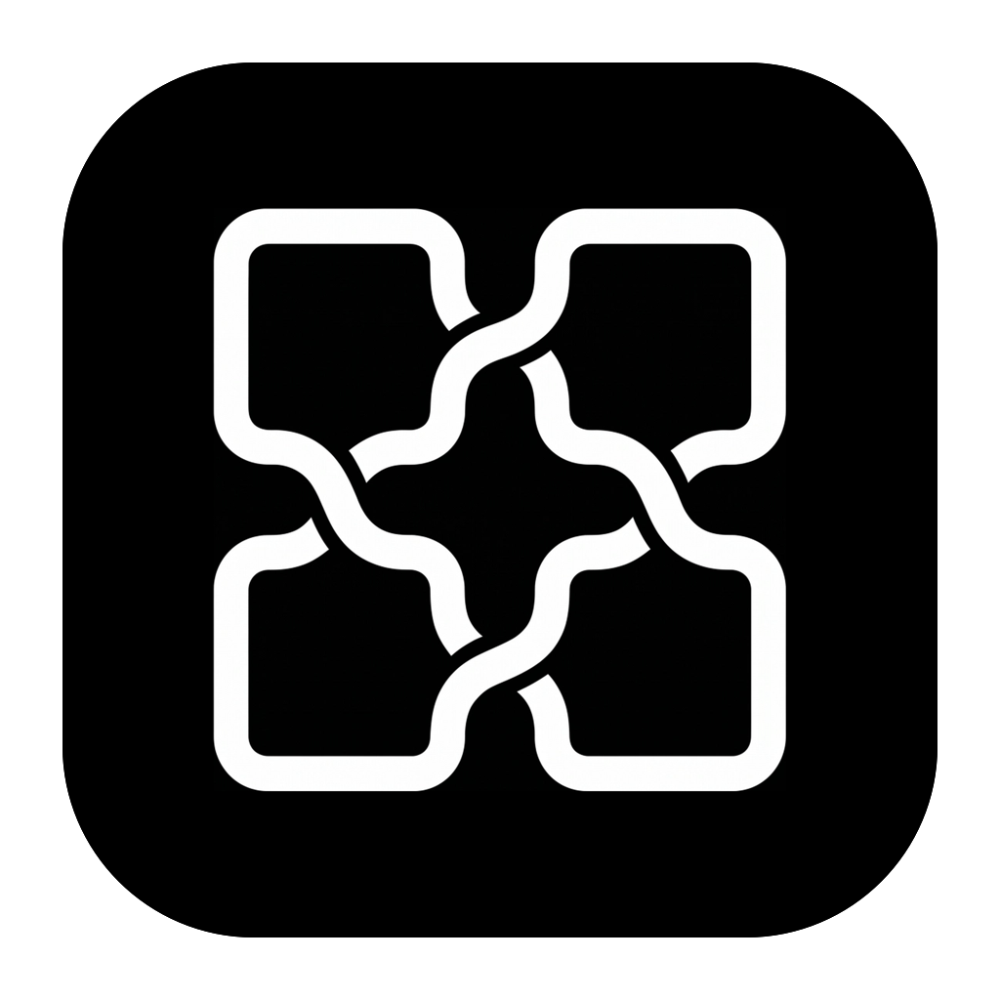
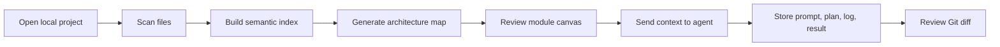

<p align="center">
  
</p>

<h1 align="center">FlowWeave</h1>

<p align="center">
  Make code projects easier to understand and AI-assisted development easier to control.
</p>

<p align="center">
  <a href="LICENSE.txt"></a>
  
  
  
</p>

FlowWeave makes code projects easier to understand and AI-assisted development easier to control.

FlowWeave is a local-first desktop workbench for reading software projects, visualizing architecture, and coordinating programming agents such as Codex, Claude, Gemini, Cursor, and custom local tools. It scans a project, builds a functional module graph, stores reviewable artifacts under `.flowweave/`, and keeps agent output tied to prompts, logs, plans, checkpoints, and Git diffs.

## Why FlowWeave

AI coding tools work best when they receive accurate project context, but real projects are hard to summarize by hand. FlowWeave sits between the repository and the agent:

- It turns files, imports, symbols, endpoints, and relationships into navigable project context.
- It presents architecture as functional modules instead of raw folder trees.
- It sends reviewable prompts to local agents and records what happened.
- It keeps implementation planning, artifact review, and Git diff review in one workflow.

The goal is not to replace an IDE. FlowWeave is the project understanding and agent orchestration layer around your existing tools.

## Project Status

FlowWeave is an active local desktop app. The current implementation focuses on:

- opening and scanning local repositories;
- generating and reviewing architecture/sequence artifacts;
- coordinating local CLI or desktop agents in plan-first workflows;
- inspecting run artifacts and Git diffs before accepting changes.

Generated project state is intentionally stored in `.flowweave/`, which is ignored by this repository's `.gitignore` for normal development.

## Core Features

- **Local project scanning**: reads a local repository, ignores unsafe or noisy paths, detects languages, and writes project metadata into `.flowweave/`.
- **Semantic indexing**: extracts imports, exports, symbols, HTTP endpoints, render targets, external calls, and cross-stack relationships across TypeScript, JavaScript, Vue, Python, Java, Go, and lightweight fallback languages.
- **Architecture canvas**: visualizes functional modules, relationships, risks, confidence, evidence, files, symbols, and editable guidance with React Flow.
- **Sequence workspace**: generates and revises structured architectural sequence diagrams with participant/message filtering and evidence panels.
- **Document workspace**: edits project-local FlowWeave docs such as PRD, README, API docs, and task specs under `.flowweave/docs/`.
- **Agent workspace**: detects, configures, runs, and health-checks built-in or custom agents; stores prompt, plan, log, and result artifacts for every run.
- **Built-in agent bridge**: installs a project-local FlowWeave plugin copy for Codex, Claude, Gemini, and Cursor desktop/CLI workflows.
- **Git review**: reads status and diffs, creates FlowWeave checkpoints, and supports explicit rollback from checkpoints.
- **Local artifact status**: tracks whether project, canvas, architecture, sequence, context, and task artifacts are current, missing, failed, or stale.

## Supported Agents

FlowWeave includes built-in adapters for:

| Agent | Protocol | Notes |
| --- | --- | --- |
| Claude Code CLI | CLI stdin | Runs Claude Code in plan mode by default. |
| Claude Desktop | Desktop bridge | Uses `.flowweave/agent-bridge` request/response files. |
| Codex CLI | CLI stdin | Runs `codex exec --sandbox read-only` for reviewable plans. |
| Codex Desktop | Desktop bridge | Uses project-local bridge requests. |
| Gemini CLI | CLI stdin | Sends FlowWeave prompts through stdin and records stdout/stderr. |
| Cursor | Desktop bridge | Opens the project and uses FlowWeave connector instructions. |
| Custom agents | CLI stdin or desktop bridge | User-configured command/app, args, protocol, and capabilities. |

Plan mode is the default. Execute mode requires explicit user confirmation, and FlowWeave creates a Git checkpoint before forwarding execute-mode work to an external agent.

## How It Works



FlowWeave persists project-specific state in a `.flowweave/` directory inside the opened project:

```txt
.flowweave/
├── project.json
├── architecture-map.json
├── sequence-diagrams.json
├── file-insights.json
├── module-map.json
├── semantic-index/
├── canvas/main.canvas.json
├── context/file-tree.md
├── docs/
├── tasks/
├── agent-bridge/
├── agent-plugins/
├── checkpoints/
└── runs/<run-id>/
    ├── prompt.md
    ├── plan.md
    ├── agent.log
    └── result.json
```

## Tech Stack

- **Desktop shell**: Electron 42 + electron-vite
- **Renderer**: React 19, TypeScript, Zustand, React Flow, Monaco Editor, Lucide icons
- **Project analysis**: fast-glob, TypeScript program analysis, Vue compiler SFC parser, Tree-sitter WASM for Python/Java/Go
- **Packaging**: electron-builder for macOS and Windows
- **Testing**: Vitest, smoke tests, packaged-app smoke checks

## Repository Layout

```txt
.
├── src/
│   ├── main/          # Electron main process, IPC, services, agent adapters
│   ├── components/    # React workspaces and UI components
│   ├── hooks/         # Renderer workflow state hooks
│   ├── stores/        # Zustand stores
│   ├── utils/         # Graph, i18n, sequence, and UI helpers
│   └── common/        # Shared IPC channel definitions
├── flowweave-plugin/  # Built-in Agent Protocol v1 bridge package
├── docs/              # Architecture, MVP, design notes, and showcase artifacts
├── logo/              # App icons and README branding assets
├── scripts/           # Build, smoke, benchmark, and asset checks
└── tests/             # Main-process and renderer tests
```

## Getting Started

### Prerequisites

- Node.js and npm
- Git
- Optional local agents: Codex CLI, Claude Code CLI, Gemini CLI, Cursor, Claude Desktop, or Codex Desktop

### Install

```bash
npm install
```

### Run in development

```bash
npm run dev
```

FlowWeave must run as the Electron desktop app to access local files, Git, and local agent processes. Opening the renderer HTML directly in a browser shows a desktop-only fallback.

### Build

```bash
npm run build
```

### Package an unpacked desktop app

```bash
npm run dist:dir
```

Platform-specific packaging scripts are also available:

```bash
npm run dist:mac:arm64
npm run dist:win:x64
npm run dist:win:arm64
```

## Useful Scripts

| Command | Purpose |
| --- | --- |
| `npm run dev` | Start the Electron development app. |
| `npm run typecheck` | Run renderer and Node TypeScript checks. |
| `npm test` | Run the Vitest suite. |
| `npm run build` | Check assets, typecheck, build Electron bundles, and check bundle size. |
| `npm run dist:dir` | Build an unpacked desktop application. |
| `npm run smoke:agent` | Run a real-agent smoke test. Requires a supported local agent. |
| `npm run smoke:packaged` | Launch and smoke-test a packaged app. |
| `npm run benchmark` | Run performance benchmarks. |

There are also internal CLI entry points under `src/main/cli/` for project scanning and agent runs. They are primarily implementation utilities used by the app and tests.

## Agent Plugin Bridge

The bundled plugin package lives in `flowweave-plugin/` and defines FlowWeave Agent Protocol v1. From the Agent workspace, FlowWeave can install or refresh a project-local copy at:

```txt
.flowweave/agent-plugins/flowweave/
```

Desktop bridge agents read pending requests from `.flowweave/agent-bridge/`, process the request in plan or execute mode, and atomically write `response.json` or `response.md`. FlowWeave imports and validates those responses before updating review state.

## Generated Artifacts

When FlowWeave opens a project, it may create local artifacts such as:

- architecture maps and module graphs;
- semantic indexes and file insights;
- sequence diagram bundles;
- document drafts and task specs;
- agent prompts, logs, plans, and results;
- Git checkpoint markers and bridge request files.

These artifacts are meant to be reviewable and reproducible. Keep them local unless you intentionally want to share a specific FlowWeave analysis snapshot.

## Safety Model

FlowWeave is designed as a local, review-first tool:

- Project scans ignore common dependency, build, cache, secret, key, and credential paths.
- Custom agent commands and arguments are validated before saving.
- Agent prompts and logs are redacted for sensitive text before being stored.
- Plan mode adds explicit dry-run instructions and does not ask agents to edit files.
- Execute mode requires explicit confirmation and creates a Git checkpoint.
- Artifact reads are restricted to known `.flowweave/runs/<run-id>/` files.
- Git rollback only accepts FlowWeave checkpoint IDs generated for the same project.

## Project Documentation

More detailed design notes are in:

- [Architecture](docs/architecture.md)
- [MVP spec](docs/mvp-spec.md)
- [Frontend design system](docs/frontend-design-system.md)
- [Creative showcase](docs/flowweave-creative-showcase.html)

## Current Scope

FlowWeave focuses on local project understanding, local agent orchestration, artifact review, and Git review. It does not currently provide cloud sync, multi-user collaboration, remote PR diff import, or a full IDE editing experience.

## License

FlowWeave is licensed under the GNU Affero General Public License v3.0. See [LICENSE.txt](LICENSE.txt).
